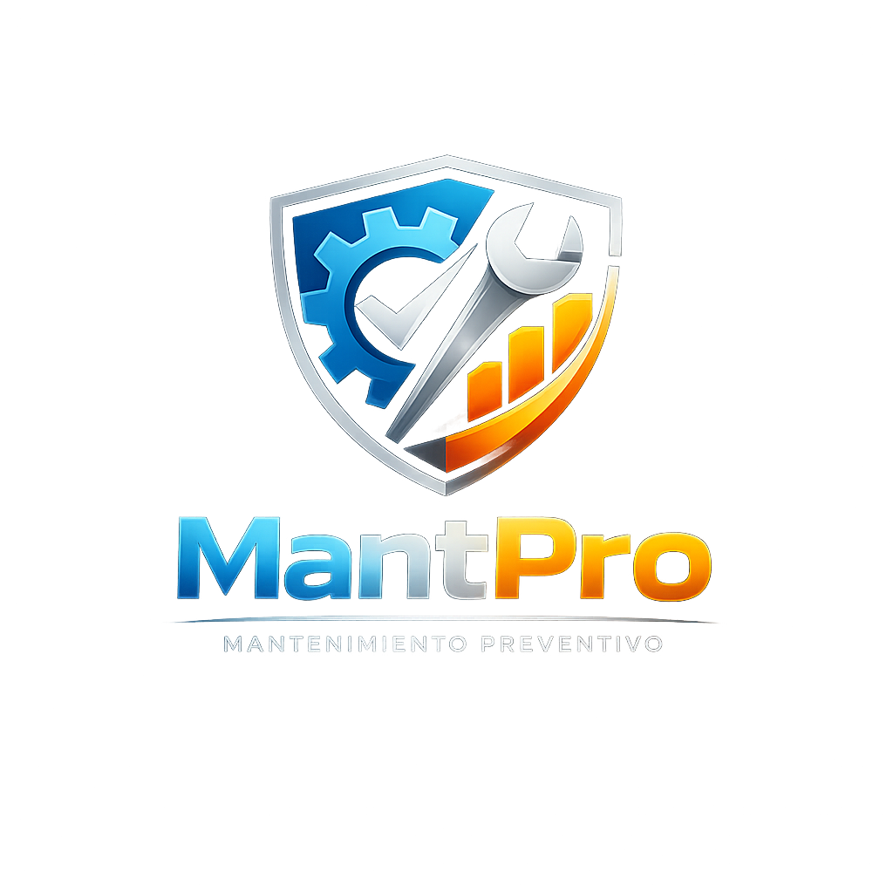
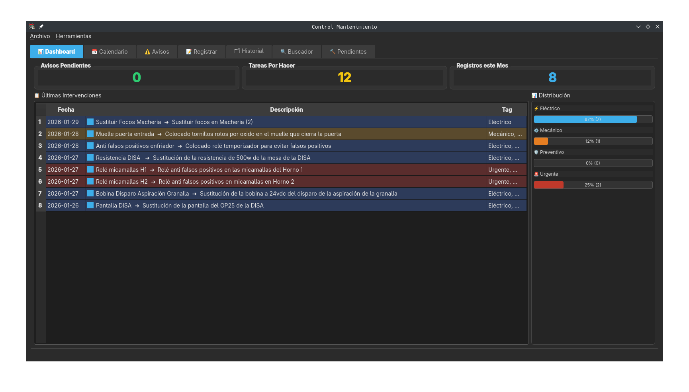
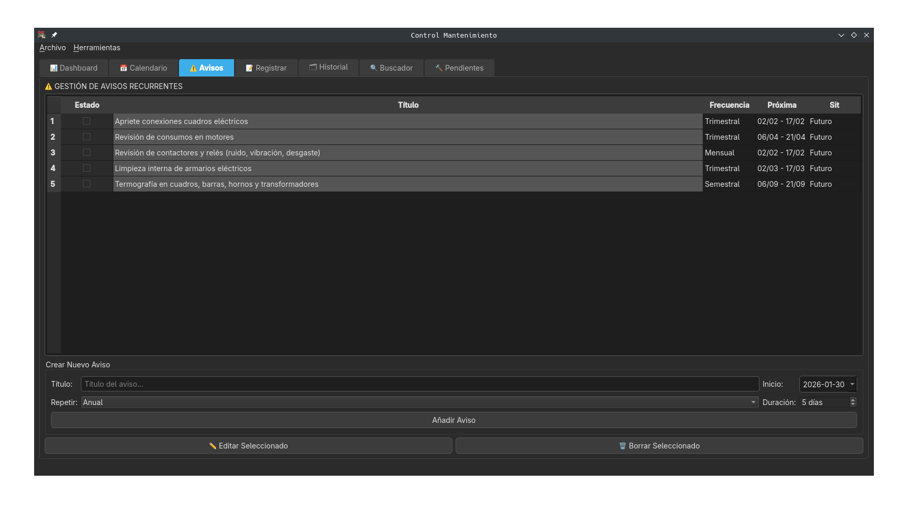
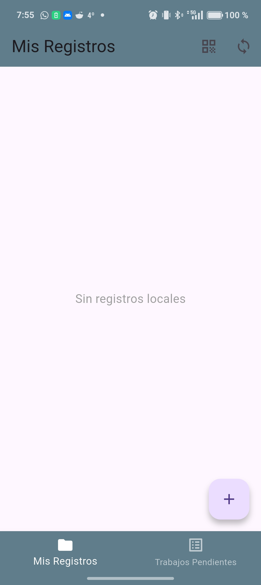
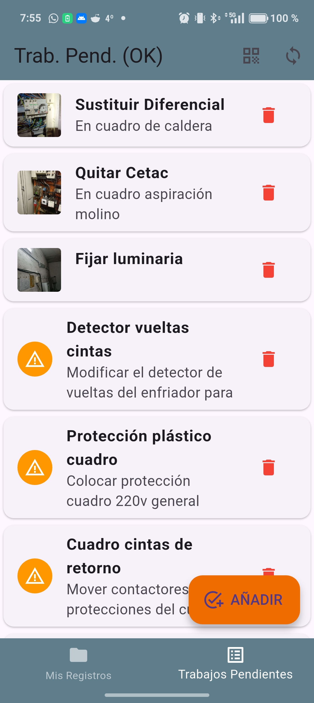

# MantPro - Sistema de Mantenimiento Preventivo

<p align="center">
  
</p>

<p align="center">
  <strong>Gestión profesional de mantenimiento preventivo y correctivo para equipos y flotas</strong>
</p>

<p align="center">
  
  
  
  
</p>

---

## 📋 Índice

- [Descargas](#-descargas)
- [Características](#-características)
- [Capturas de Pantalla](#-capturas-de-pantalla)
- [Requisitos](#-requisitos)
- [Instalación](#-instalación)
- [Uso](#-uso)
- [Sincronización PC-Móvil](#-sincronización-pc-móvil)
- [Estructura del Proyecto](#-estructura-del-proyecto)
- [Contribuir](#-contribuir)
- [Licencia](#-licencia)
- [Contacto](#-contacto)

---

## 📦 Descargas

Puedes descargar las versiones precompiladas desde [GitHub Releases](https://github.com/AnabasaSoft/MantPro/releases):

- **Windows**: Ejecutable `.exe` para Windows
- **Linux**: 
  - Binario ejecutable de Linux
  - AppImage portable
  - También disponible en **AUR** (Arch User Repository)
- **Android**: Archivo `.apk` para instalación directa

---

## ✨ Características

### 💻 Aplicación de Escritorio (PC)

- **📅 Calendario Interactivo**: Visualiza y gestiona tareas de mantenimiento con códigos de color
- **📊 Gestión de Equipos**: Base de datos completa con información de vehículos/equipos
- **🏢 Gestión de Clientes**: Registro detallado de clientes con datos de contacto y localización
- **📝 Historial Completo**: Registro histórico de todas las intervenciones realizadas
- **📄 Reportes PDF**: Generación automática de informes profesionales con logo personalizable
- **📸 Gestión de Imágenes**: Almacenamiento y visualización de fotos de intervenciones
- **📱 Sincronización Móvil**: Servidor integrado para sincronización con la app móvil
- **🔍 Sistema de Búsqueda**: Búsqueda avanzada por fechas, tags y contenido
- **📦 Backup/Restore**: Exportación e importación de base de datos completa
- **🏷️ Sistema de Tags**: Categorización con etiquetas (Urgente, Eléctrico, Mecánico, Preventivo)
- **🔔 Tareas Pendientes**: Gestión de trabajos pendientes y planificación
- **📊 Estadísticas**: Análisis de intervenciones por tipo y período

### 📱 Aplicación Móvil (Android)

- **📝 Registro Rápido**: Captura de intervenciones sobre el terreno
- **📷 Cámara Integrada**: Toma de fotos y edición con anotaciones
- **✏️ Editor de Imágenes**: Dibuja sobre las fotos para marcar áreas de interés
- **🔄 Sincronización Automática**: Envío automático de datos al PC mediante código QR
- **💾 Almacenamiento Local**: Guarda registros offline hasta sincronizar
- **📋 Trabajos Pendientes**: Visualiza y gestiona tareas asignadas desde el PC
- **🏷️ Tags Rápidos**: Sistema de etiquetado rápido con checkboxes
- **🔌 Modo Offline**: Trabaja sin conexión y sincroniza cuando estés disponible

---

## 📸 Capturas de Pantalla

### Aplicación de Escritorio

<p align="center">
  
  
</p>

### Aplicación Móvil

<p align="center">
  
  
</p>

---

## 🔧 Requisitos

### Aplicación de Escritorio

- **Python**: 3.8 o superior
- **Sistema Operativo**: Windows o Linux
- **Dependencias Python**:
  - PyQt6
  - Flask
  - ReportLab
  - qrcode
  - requests
  - sqlite3 (incluido en Python)

### Aplicación Móvil

- **Flutter**: 3.0 o superior
- **Dart SDK**: 2.17 o superior
- **Android**: API Level 21+ (Android 5.0+)

---

## 📥 Instalación

### Aplicación de Escritorio

#### Opción 1: Descarga Precompilada (Recomendado)

Descarga la versión correspondiente a tu sistema desde [GitHub Releases](https://github.com/AnabasaSoft/MantPro/releases):

- **Windows**: Descarga y ejecuta el `.exe`
- **Linux**: 
  - Descarga el binario ejecutable y dale permisos de ejecución: `chmod +x mantpro`
  - O usa el **AppImage** (sin instalación): `chmod +x MantPro.AppImage && ./MantPro.AppImage`
  - **Arch Linux**: Disponible en AUR: `yay -S mantpro` o `paru -S mantpro`

#### Opción 2: Instalación desde Código Fuente

1. **Clonar el repositorio**:
   ```bash
   git clone https://github.com/AnabasaSoft/MantPro.git
   cd MantPro
   ```

2. **Crear entorno virtual** (recomendado):
   ```bash
   python -m venv venv
   source venv/bin/activate  # En Windows: venv\Scripts\activate
   ```

3. **Instalar dependencias**:
   ```bash
   pip install -r requirements.txt
   ```

4. **Ejecutar la aplicación**:
   ```bash
   python main.py
   ```

### Aplicación Móvil

#### Opción 1: Descarga Directa (Recomendado)

Descarga el archivo `.apk` desde [GitHub Releases](https://github.com/AnabasaSoft/MantPro/releases) e instálalo en tu dispositivo Android.

**Nota**: Es posible que necesites habilitar "Orígenes desconocidos" en la configuración de seguridad de tu dispositivo.

#### Opción 2: Compilar desde Código Fuente

1. **Navegar al directorio móvil**:
   ```bash
   cd mobile_app
   ```

2. **Instalar dependencias**:
   ```bash
   flutter pub get
   ```

3. **Ejecutar en dispositivo/emulador**:
   ```bash
   flutter run
   ```

4. **Compilar APK (Android)**:
   ```bash
   flutter build apk --release
   ```

---

## 🚀 Uso

### Primera Configuración

#### Aplicación de Escritorio

1. **Iniciar la aplicación**: Ejecuta `python main.py`
2. **Configurar logo** (opcional): Menú > Configuración > Cambiar Logo
3. **Añadir equipos**: Pestaña "Equipos" > Botón "Añadir Equipo"
4. **Añadir clientes**: Pestaña "Clientes" > Botón "Añadir Cliente"
5. **Iniciar servidor**: Menú > Servidor > Iniciar Servidor (para sincronización móvil)

#### Aplicación Móvil

1. **Instalar la app** en tu dispositivo móvil
2. **Conectar con PC**: 
   - Asegúrate de que el PC y el móvil están en la misma red WiFi
   - En el PC: Menú > Servidor > Mostrar QR de Conexión
   - En el móvil: Tap en el icono QR y escanea el código
3. **Listo**: Ya puedes registrar intervenciones desde el móvil

### Flujo de Trabajo Típico

#### Desde el PC

1. **Crear tarea pendiente**:
   - Pestaña "Pendientes" > Botón "Añadir Pendiente"
   - Asociar a un equipo/cliente
   - Generar QR para el técnico

2. **Revisar trabajos completados**:
   - Los trabajos sincronizados desde móvil aparecen automáticamente
   - Revisa fotos y detalles en el calendario
   - Genera PDF de informe si es necesario

3. **Generar reportes**:
   - Menú > Exportar > Exportar PDF
   - Selecciona rango de fechas
   - Elige si incluir fotos en el informe

#### Desde el Móvil

1. **Escanear trabajo pendiente** (opcional):
   - Si el PC te asignó un trabajo, escanea el QR
   - Se cargará automáticamente la información

2. **Registrar intervención**:
   - Tap en "Nuevo" o selecciona trabajo pendiente
   - Completa título y detalles
   - Toma foto con la cámara
   - Dibuja/anota sobre la foto si es necesario
   - Selecciona tags apropiados
   - Guarda

3. **Sincronizar**:
   - Tap en el icono de sincronización
   - Los registros se envían automáticamente al PC
   - Se eliminan del móvil al confirmar envío exitoso

---

## 🔄 Sincronización PC-Móvil

### Cómo Funciona

MantPro utiliza un sistema de sincronización basado en:

1. **Servidor Flask** integrado en la app de escritorio
2. **Códigos QR** para conexión rápida y segura
3. **API REST** para comunicación entre dispositivos
4. **WiFi local** - sin necesidad de internet

### Configuración de Red

Para que la sincronización funcione:

- ✅ PC y móvil deben estar en la **misma red WiFi**
- ✅ El **firewall** debe permitir conexiones en el puerto 5000 (o el configurado)
- ✅ Si usas Windows, puede que necesites crear una excepción de firewall

### Solución de Problemas

**El móvil no conecta con el PC:**
- Verifica que ambos dispositivos están en la misma red
- Comprueba que el servidor está activo en el PC (icono verde)
- Prueba a desactivar temporalmente el firewall del PC
- Regenera el código QR y vuelve a escanearlo

**Las fotos no se sincronizan:**
- Verifica que hay espacio suficiente en el disco del PC
- Comprueba los permisos de la carpeta `fotos_mantenimiento`
- Asegúrate de que la foto se guardó correctamente en el móvil

---

## 📁 Estructura del Proyecto

```
MantPro/
├── main.py                      # Aplicación principal de escritorio
├── requirements.txt             # Dependencias Python
├── logo.png                     # Logo de la aplicación
├── README.md                    # Este archivo
├── fotos_mantenimiento/         # Carpeta de imágenes
├── mantenimiento.db             # Base de datos SQLite
├── mobile_app/                  # Aplicación móvil Flutter
│   ├── main.dart               # Código principal móvil
│   ├── pubspec.yaml            # Dependencias Flutter
│   └── android/                # Configuración Android
├── backups/                     # Backups de base de datos
└── docs/                        # Documentación adicional
```

### Base de Datos

La aplicación utiliza SQLite con las siguientes tablas:

- **`tareas`**: Registro de intervenciones realizadas
- **`equipos`**: Catálogo de equipos/vehículos
- **`clientes`**: Base de datos de clientes
- **`pendientes`**: Tareas pendientes de realizar

---

## 🤝 Contribuir

¡Las contribuciones son bienvenidas! Si quieres mejorar MantPro:

1. **Fork** el proyecto
2. Crea una **rama** para tu feature (`git checkout -b feature/AmazingFeature`)
3. **Commit** tus cambios (`git commit -m 'Add some AmazingFeature'`)
4. **Push** a la rama (`git push origin feature/AmazingFeature`)
5. Abre un **Pull Request**

### Ideas de Mejora

- [ ] Implementar notificaciones push para recordatorios
- [ ] Añadir gráficas de estadísticas más detalladas
- [ ] Integración con calendario de Google
- [X] Modo oscuro
- [ ] Multi-idioma
- [X] Exportación a Excel
- [ ] API para integración con otros sistemas
- [ ] Firma digital de trabajos completados

---

## 📄 Licencia

Este proyecto está bajo la Licencia MIT. Ver el archivo `LICENSE` para más detalles.

```
MIT License

Copyright (c) 2026 AnabasaSoft

Permission is hereby granted, free of charge, to any person obtaining a copy
of this software and associated documentation files (the "Software"), to deal
in the Software without restriction, including without limitation the rights
to use, copy, modify, merge, publish, distribute, sublicense, and/or sell
copies of the Software, and to permit persons to whom the Software is
furnished to do so, subject to the following conditions:

The above copyright notice and this permission notice shall be included in all
copies or substantial portions of the Software.

THE SOFTWARE IS PROVIDED "AS IS", WITHOUT WARRANTY OF ANY KIND, EXPRESS OR
IMPLIED, INCLUDING BUT NOT LIMITED TO THE WARRANTIES OF MERCHANTABILITY,
FITNESS FOR A PARTICULAR PURPOSE AND NONINFRINGEMENT. IN NO EVENT SHALL THE
AUTHORS OR COPYRIGHT HOLDERS BE LIABLE FOR ANY CLAIM, DAMAGES OR OTHER
LIABILITY, WHETHER IN AN ACTION OF CONTRACT, TORT OR OTHERWISE, ARISING FROM,
OUT OF OR IN CONNECTION WITH THE SOFTWARE OR THE USE OR OTHER DEALINGS IN THE
SOFTWARE.
```

---

## 📧 Contacto

**AnabasaSoft**

- 📧 Email: [anabasasoft@gmail.com](mailto:anabasasoft@gmail.com)
- 🌐 GitHub: [github.com/AnabasaSoft](https://github.com/AnabasaSoft)
- 💼 Proyecto: [github.com/AnabasaSoft/MantPro](https://github.com/AnabasaSoft/MantPro)

---

## 🙏 Agradecimientos

- **PyQt6** - Framework GUI multiplataforma
- **Flutter** - SDK para desarrollo móvil
- **ReportLab** - Generación de PDFs
- **SQLite** - Base de datos embebida
- **Flask** - Microframework web para el servidor de sincronización

---

<p align="center">
  Hecho con ❤️ por AnabasaSoft
</p>

<p align="center">
  <sub>Si este proyecto te ha sido útil, ¡dale una ⭐️!</sub>
</p>
