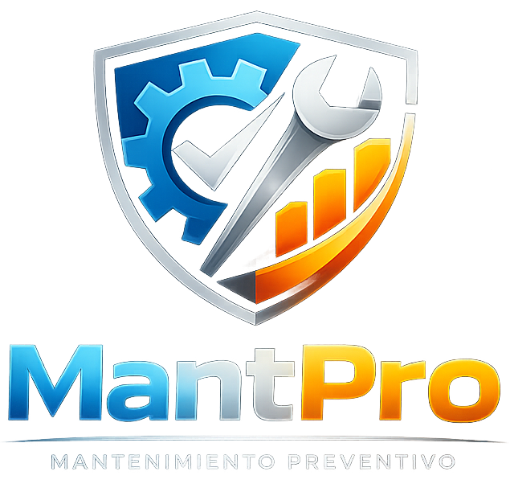

<div align="center">MantPro: Sistema Integral de MantenimientoGestión de Mantenimiento Industrial | Sincronización PC-Móvil | Reportes PDF</div>📋 DescripciónMantPro es una solución de doble plataforma (Escritorio + Móvil) diseñada para optimizar la gestión del mantenimiento industrial. Permite llevar un control exhaustivo de tareas preventivas y correctivas, gestionar avisos recurrentes y generar documentación oficial.El sistema destaca por su capacidad de sincronización en red local: el PC actúa como servidor central, permitiendo a los operarios usar la app móvil para registrar incidencias, completar tareas y adjuntar evidencias fotográficas (incluso editadas/dibujadas) directamente desde la planta.🚀 Características Principales💻 Aplicación de Escritorio (Python/PyQt6)El centro de mando para el responsable de mantenimiento.Dashboard Interactivo: Estadísticas visuales de avisos, tareas pendientes y distribución por tipo (Eléctrico, Mecánico, etc.).Servidor de Sincronización: Servidor Flask integrado que recibe datos de la app móvil en tiempo real.Gestión de Calendario: * Integración automática de festivos nacionales, autonómicos y provinciales de España (Configurable).Visualización de tareas y avisos recurrentes.Reportes PDF Profesionales: Exportación de historiales con logotipos personalizados y fotos adjuntas.Sistema de Avisos: Configuración de mantenimientos recurrentes (Anual, Mensual, etc.) con alertas visuales.Base de Datos Robusta: SQLite local con sistema de Backup/Restore automático y manual (ZIP).📱 Aplicación Móvil (Flutter)La herramienta de campo para el operario.Modo Offline/Online: Permite crear registros sin conexión y sincronizarlos cuando se conecta a la red del PC.Escáner QR: Emparejamiento instantáneo con el PC mediante código QR.Gestión de Fotos: * Cámara integrada.Editor de imágenes: Dibuja o marca zonas sobre la foto antes de enviarla.Lista de Pendientes: Descarga las tareas asignadas desde el PC para completarlas in situ.Sincronización Inteligente: Cola de salida automática para asegurar que ningún dato se pierda.🛠️ Instalación y Requisitos1. Entorno de Escritorio (PC)Desarrollado y probado en Manjaro Linux, compatible con Windows y macOS.Requisitos:Python 3.xLibrerías listadas en requirements.txt# Clonar el repositorio
git clone [https://github.com/TU_USUARIO/MantPro.git](https://github.com/TU_USUARIO/MantPro.git)
cd MantPro

# (Opcional) Crear entorno virtual
python -m venv venv
source venv/bin/activate  # En Linux/Mac

# Instalar dependencias
pip install -r requirements.txt

# Ejecutar la aplicación
python main.py
2. Entorno Móvil (Android)Requisitos:Flutter SDK instalado.Dispositivo Android o Emulador.cd mobile_app  # (O la carpeta donde esté el código Flutter)

# Obtener dependencias
flutter pub get

# Ejecutar en dispositivo conectado
flutter run

# Generar APK para instalación
flutter build apk --release
🔄 Flujo de Trabajo y SincronizaciónEl sistema utiliza una arquitectura donde el PC es la "Fuente de la Verdad".Iniciar Servidor: Al abrir la app de escritorio, se inicia automáticamente un servidor local en el puerto 5000.Emparejar: * En el PC: Menú Herramientas -> Sincronizar App (QR).En el Móvil: Botón QR en la barra superior -> Escanear pantalla del PC.Intercambio de Datos:Subida: El móvil envía nuevos registros con fotos y detalles.Bajada: El móvil descarga la lista de "Pendientes" creados en el PC.Completar: Al finalizar un trabajo en el móvil, este se marca como completado en el PC y pasa al historial automáticamente.Nota: Ambos dispositivos deben estar conectados a la misma red Wi-Fi (Red Local) para que la sincronización funcione.📂 Estructura del ProyectoMantPro/
├── main.py                 # Código fuente Aplicación Escritorio
├── main.dart               # Código fuente Aplicación Móvil
├── icono.png               # Icono principal (1024px)
├── mantenimiento.db        # Base de datos SQLite (Generada automáticamente)
├── fotos_recibidas/        # Almacén local de imágenes sincronizadas
├── backups/                # Copias de seguridad manuales
├── backups_auto/           # Copias de seguridad automáticas al cerrar
└── festivos_cache.json     # Caché de calendario laboral
📸 Capturas de PantallaDashboard PCCalendario y FestivosApp Móvil - Edición[Inserta aquí captura del PC][Inserta aquí captura del calendario][Inserta aquí captura del móvil]📄 LicenciaEste proyecto está bajo la Licencia MIT - ver el archivo LICENSE para más detalles.<div align="center"><sub>Desarrollado con ❤️ y mucho café para el mantenimiento industrial eficiente.</sub></div>
### Consejos adicionales antes de subirlo:

1.  **Capturas:** Si puedes, saca un par de capturas de pantalla reales (una del dashboard del PC y una de la app móvil) y súbelas al repo (o a una carpeta `screenshots/`). Luego edita el README donde pone `[Inserta aquí captura...]` para enlazarlas. Queda muchísimo mejor.
2.  **Requirements.txt:** Asegúrate de generar el archivo `requirements.txt` en la raíz del proyecto para que la gente sepa qué instalar. Dado tu código, debería contener al menos:
    ```text
    PyQt6
    reportlab
    flask
    requests
    qrcode
    xlsxwriter
    ```
