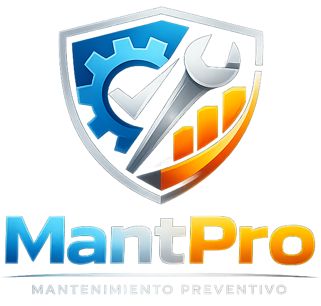
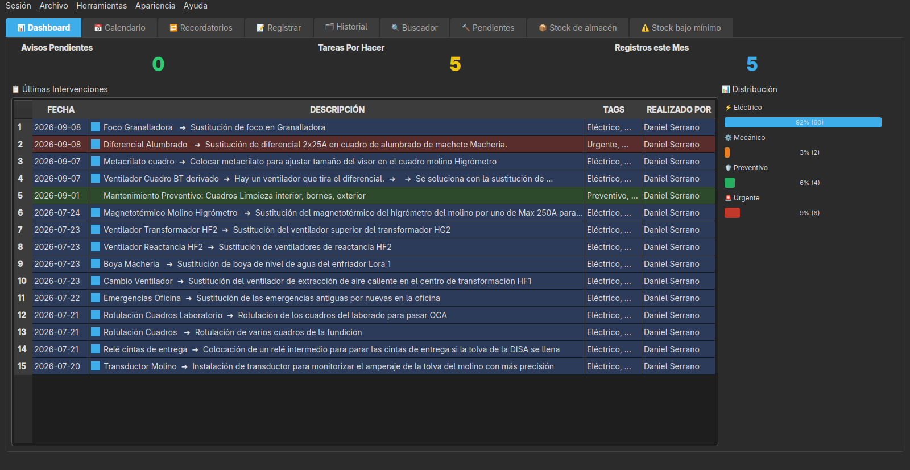
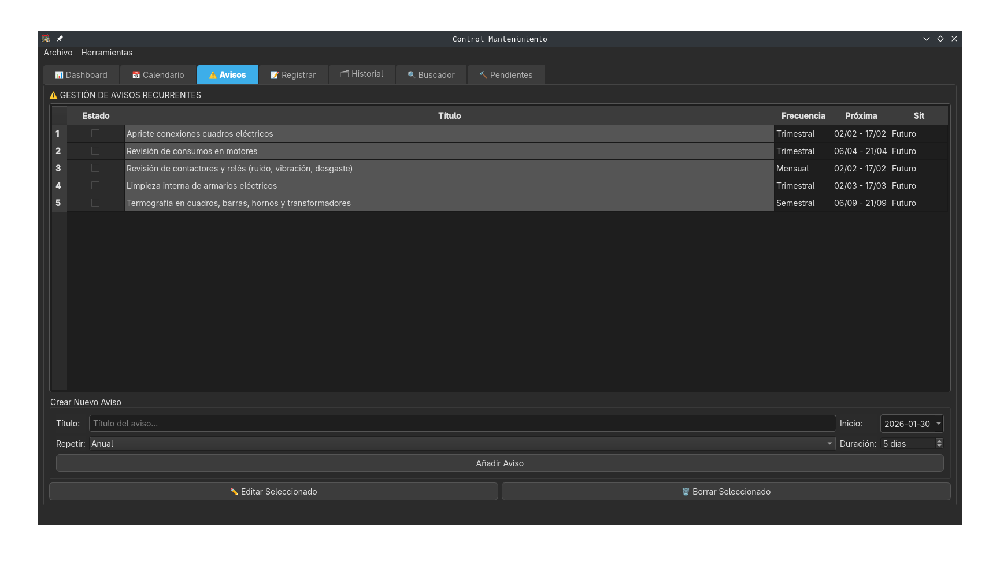
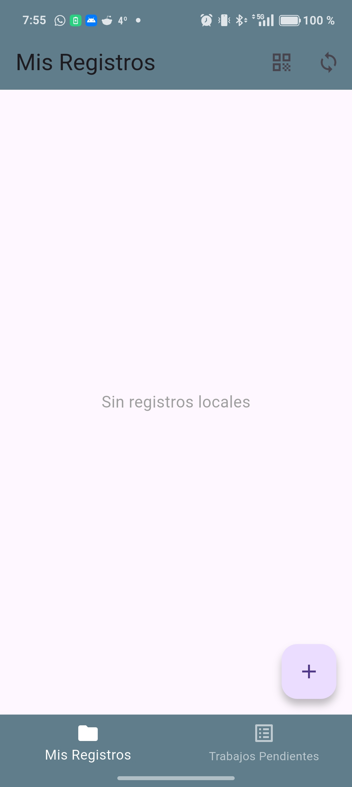
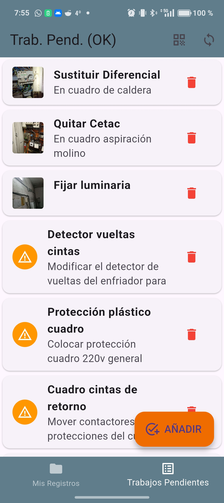

# MantPro - Sistema de Mantenimiento Preventivo

<p align="center">
  
</p>

<p align="center">
  <strong>Gestión profesional de mantenimiento preventivo y correctivo para equipos y flotas</strong>
</p>

<p align="center">
  
  
  
  
</p>

---

## 📋 Índice

- [Descargas](#-descargas)
- [Características](#-características)
- [Capturas de Pantalla](#-capturas-de-pantalla)
- [Requisitos](#-requisitos)
- [Instalación](#-instalación)
- [Uso](#-uso)
- [Usuarios y Acceso](#-usuarios-y-acceso)
- [Sincronización PC-Móvil](#-sincronización-pc-móvil)
- [Estructura del Proyecto](#-estructura-del-proyecto)
- [Contribuir](#-contribuir)
- [Roadmap](#-roadmap)
- [Licencia](#-licencia)
- [Contacto](#-contacto)

---

## 📦 Descargas

Puedes descargar las versiones precompiladas desde [GitHub Releases](https://github.com/AnabasaSoft/MantPro/releases):

- **Windows**: Ejecutable `.exe` para Windows
- **Linux**: 
  - Binario ejecutable de Linux
  - AppImage portable
  - También disponible en **AUR** (Arch User Repository)
- **Android**: Archivo `.apk` para instalación directa

---

## ✨ Características

### 💻 Aplicación de Escritorio (PC)

- **👥 Gestión de Usuarios**: Login con usuario y contraseña, roles de administrador y técnico, alta y baja de usuarios, y restablecimiento de contraseñas
- **✍️ Autoría de los Trabajos**: Cada intervención guarda quién la realizó, visible en el historial y en los informes
- **🔒 Permisos por Registro**: un técnico solo puede editar o borrar sus propios trabajos; un administrador puede gestionar cualquiera, incluida la reasignación del autor de uno o varios registros a la vez
- **📋 Auditoría de Cambios**: registro de quién edita o borra cada trabajo (no solo quién lo creó), consultable y filtrable por técnico y por tipo de acción desde "Registro de cambios" (solo administradores)
- **🎨 Temas Visuales**: elige entre modo oscuro (por defecto), claro o un estilo retro inspirado en Windows 98, desde el menú "Apariencia"
- **📅 Calendario Interactivo**: Visualiza y gestiona tareas de mantenimiento con códigos de color (festivos, vacaciones, días con tareas)
- **📝 Historial Completo**: Registro histórico de todas las intervenciones realizadas, con fotos antes/después
- **📄 Reportes PDF**: Generación automática de informes profesionales con logo personalizable
- **📸 Gestión de Imágenes**: Almacenamiento y visualización de fotos de intervenciones
- **📱 Sincronización Móvil**: Servidor integrado (arranca automáticamente) para sincronización con la app móvil vía QR
- **🔍 Sistema de Búsqueda**: Búsqueda avanzada por fechas, tags y contenido
- **👤 Filtro por Técnico**: Filtra el historial y las exportaciones (PDF, CSV y Excel) por la persona que hizo el trabajo
- **📦 Backup/Restore**: Exportación e importación de base de datos completa, eligiendo dónde guardar cada copia de seguridad
- **🏷️ Sistema de Tags**: Categorización con etiquetas (Urgente, Eléctrico, Mecánico, Preventivo)
- **🔨 Tareas Pendientes**: Gestión de trabajos pendientes (crear, completar, editar, eliminar) y **asignación a un técnico concreto**
- **⚠️ Avisos Recurrentes**: Avisos de mantenimiento que se repiten automáticamente
- **📊 Exportación**: A PDF, CSV y Excel, con filtro opcional por técnico

### 📱 Aplicación Móvil (Android)

- **🔐 Acceso con Usuario**: Cada técnico inicia sesión una vez y la sesión queda guardada en el dispositivo
- **📝 Registro Rápido**: Captura de intervenciones sobre el terreno, firmadas automáticamente con su usuario
- **📷 Cámara Integrada**: Toma de fotos y edición con anotaciones
- **✏️ Editor de Imágenes**: Dibuja sobre las fotos para marcar áreas de interés
- **🔄 Sincronización Automática**: Envío automático de datos al PC mediante código QR
- **💾 Almacenamiento Local**: Guarda registros offline hasta sincronizar
- **📋 Trabajos Pendientes**: Visualiza y gestiona tareas asignadas desde el PC, con filtro **"Solo míos"**
- **🔄 Puesta al Día al Abrir**: Al arrancar, la app sincroniza en segundo plano los datos de todas las pestañas
- **🏷️ Tags Rápidos**: Sistema de etiquetado rápido con checkboxes
- **🔌 Modo Offline**: Trabaja sin conexión y sincroniza cuando estés disponible
- **⏰ Recordatorios Diarios**: Notificación automática a las 8:00 AM (hora local) si hay trabajos pendientes sin completar

---

## 📸 Capturas de Pantalla

### Aplicación de Escritorio

<p align="center">
  
  
</p>

### Aplicación Móvil

<p align="center">
  
  
</p>

---

## 🔧 Requisitos

### Aplicación de Escritorio

- **Python**: 3.8 o superior
- **Sistema Operativo**: Windows o Linux
- **Dependencias Python**:
  - PyQt6
  - Flask
  - ReportLab
  - qrcode
  - requests
  - xlsxwriter
  - sqlite3 (incluido en Python)

### Aplicación Móvil

- **Flutter**: 3.0 o superior
- **Dart SDK**: 2.17 o superior
- **Android**: API Level 21+ (Android 5.0+)

---

## 📥 Instalación

### Aplicación de Escritorio

#### Opción 1: Descarga Precompilada (Recomendado)

Descarga la versión correspondiente a tu sistema desde [GitHub Releases](https://github.com/AnabasaSoft/MantPro/releases):

- **Windows**: Descarga y ejecuta el `.exe`
- **Linux**: 
  - Descarga el binario ejecutable y dale permisos de ejecución: `chmod +x mantpro`
  - O usa el **AppImage** (sin instalación): `chmod +x MantPro.AppImage && ./MantPro.AppImage`
  - Los paquetes **`.deb`** y **`.rpm`** están firmados digitalmente con GPG (ver [Verificar la firma de los paquetes](#-verificar-la-firma-de-los-paquetes-linux))
  - **Arch Linux**: Disponible en AUR: `yay -S mantpro` o `paru -S mantpro`

#### 🔏 Verificar la firma de los paquetes (Linux)

Los paquetes `.deb` y `.rpm` publicados en cada release están firmados con la clave GPG oficial de AnabasaSoft. Para verificarlos antes de instalar:

1. Descarga la clave pública del repositorio ([`firma/anabasasoft_public.asc`](firma/anabasasoft_public.asc)):
   ```bash
   curl -sL https://raw.githubusercontent.com/AnabasaSoft/MantPro/main/firma/anabasasoft_public.asc -o anabasasoft_public.asc
   ```

2. Importa la clave y verifica el paquete:
   ```bash
   # RPM
   sudo rpm --import anabasasoft_public.asc
   rpm --checksig mantpro-*.rpm

   # DEB (requiere dpkg-sig)
   gpg --import anabasasoft_public.asc
   dpkg-sig --verify mantpro_*.deb
   ```

Una firma válida confirma que el paquete procede de AnabasaSoft y no ha sido modificado.

#### Opción 2: Instalación desde Código Fuente

1. **Clonar el repositorio**:
   ```bash
   git clone https://github.com/AnabasaSoft/MantPro.git
   cd MantPro
   ```

2. **Crear entorno virtual** (recomendado):
   ```bash
   python -m venv venv
   source venv/bin/activate  # En Windows: venv\Scripts\activate
   ```

3. **Instalar dependencias**:
   ```bash
   pip install -r requirements.txt
   ```

4. **Ejecutar la aplicación**:
   ```bash
   python main.py
   ```

### Aplicación Móvil

#### Opción 1: Descarga Directa (Recomendado)

Descarga el archivo `.apk` desde [GitHub Releases](https://github.com/AnabasaSoft/MantPro/releases) e instálalo en tu dispositivo Android.

**Nota**: Es posible que necesites habilitar "Orígenes desconocidos" en la configuración de seguridad de tu dispositivo.

#### Opción 2: Compilar desde Código Fuente

1. **Navegar al directorio móvil**:
   ```bash
   cd mantenimiento_app
   ```

2. **Instalar dependencias**:
   ```bash
   flutter pub get
   ```

3. **Ejecutar en dispositivo/emulador**:
   ```bash
   flutter run
   ```

4. **Compilar APK (Android)**:
   ```bash
   flutter build apk --release
   ```

---

## 🚀 Uso

### Primera Configuración

#### Aplicación de Escritorio

1. **Iniciar la aplicación**: Ejecuta `python main.py` (el servidor de sincronización arranca solo, no hace falta iniciarlo a mano)
2. **Primer acceso**: En el primer arranque se crea el usuario `admin` con contraseña `admin`. La aplicación **obliga a cambiarla** al entrar
3. **Crear los usuarios**: Menú `Herramientas` > `👥 Gestión de usuarios` > da de alta a cada técnico
4. **Configurar logo** (opcional): Menú `Archivo` > `📄 Opciones PDF` > `🖼️ Añadir / Cambiar Logo`
5. **Registrar un trabajo**: Pestaña "📝 Registrar" > rellena resumen/detalles > "💾 GUARDAR REGISTRO"
6. **Crear un pendiente**: Pestaña "🔨 Pendientes" > grupo "Nuevo Trabajo" (Título + Detalles + "Asignar a") > "Añadir"

#### Aplicación Móvil

1. **Instalar la app** en tu dispositivo móvil
2. **Conectar con PC**:
   - Asegúrate de que el PC y el móvil están en la misma red WiFi
   - En el PC: Menú `Herramientas` > `📲 Sincronizar App (QR)`
   - En el móvil: Tap en "Vincular PC" y escanea el código
3. **Iniciar sesión**: Introduce el usuario y la contraseña que te haya creado el administrador. La sesión queda guardada: solo hay que hacerlo una vez
4. **Listo**: Ya puedes registrar intervenciones desde el móvil

### Flujo de Trabajo Típico

#### Desde el PC

1. **Crear y asignar una tarea pendiente**:
   - Pestaña "🔨 Pendientes" > grupo "Nuevo Trabajo" > rellena Título y Detalles, elige el técnico en "Asignar a" > "Añadir"
   - Gestiónala con los botones "✅ Completar", "✏️ Editar", "❌ Eliminar" o "👤 Reasignar"
   - El desplegable "Ver los de" filtra la lista por técnico (incluye "Sin asignar")

2. **Revisar trabajos completados**:
   - Los trabajos sincronizados desde el móvil aparecen automáticamente
   - Revisa fotos (antes/después) y detalles en la pestaña "🗂 Historial" o en el "📅 Calendario"
   - La columna "Realizado por" indica quién hizo cada trabajo, y el desplegable de arriba permite ver solo los de una persona

3. **Generar reportes**:
   - Menú `Archivo` > `📄 Opciones PDF` > `📄 Generar PDF Ahora`
   - En el diálogo puedes elegir el técnico, y su nombre aparece en el título del informe
   - O exporta a `📄 CSV` / `📊 Excel` desde el mismo menú `Archivo`

#### Desde el Móvil

1. **Vincular con el PC e iniciar sesión** (solo la primera vez, o si cambias de red):
   - Tap en "Vincular PC" y escanea el QR que muestra el PC
   - Introduce tu usuario y contraseña
   - El móvil guarda la dirección del PC y tu sesión para sincronizar automáticamente a partir de ahí

2. **Registrar intervención**:
   - Tap en "Nuevo" o selecciona un trabajo pendiente ya sincronizado desde el PC
   - Con el chip "Solo míos" ves únicamente los trabajos que te han asignado
   - Completa título y detalles
   - Toma foto "antes" y, opcionalmente, foto "después" con la cámara
   - Dibuja/anota sobre la foto si es necesario
   - Selecciona tags apropiados
   - Guarda

3. **Sincronizar**:
   - Al abrir la app se sincroniza todo en segundo plano (verás un indicador en la barra superior)
   - También puedes forzarlo tirando de la lista hacia abajo o con el icono de sincronización
   - Los registros se envían al PC y se eliminan del móvil al confirmar el envío
   - Todo funciona sin conexión: lo pendiente se guarda y se sube cuando hay cobertura

---

## 👥 Usuarios y Acceso

### Roles

| Rol | Puede hacer |
|-----|-------------|
| **Administrador** | Todo lo del técnico, más dar de alta y de baja usuarios, cambiar roles, restablecer contraseñas, editar o borrar **cualquier** registro del historial, reasignar el autor de uno o varios registros a la vez, y consultar el registro de auditoría de cambios |
| **Técnico** | Registrar trabajos, completar pendientes y avisos, editar o borrar **solo sus propios** registros del historial, y cambiar su propia contraseña |

Siempre debe quedar **al menos un administrador activo**: la aplicación impide
quitarle el rol o desactivarlo al último que queda.

### Gestión desde el PC

- **Alta**: `Herramientas` > `👥 Gestión de usuarios` > rellena usuario, nombre,
  contraseña y rol > "➕ Añadir". Si dejas marcado "Pedir cambio al entrar", la
  persona tendrá que definir su propia contraseña en el primer acceso.
- **Baja**: se hace de forma **lógica** (el usuario queda inactivo). Nunca se
  borra, para no romper la autoría de los trabajos que ya hizo.
- **Restablecer contraseña**: útil cuando alguien la olvida. Al cambiarla se
  cierran automáticamente todas las sesiones abiertas de esa persona en el móvil.
- **Cambiar la propia contraseña**: `Herramientas` > `🔑 Cambiar mi contraseña`.

### Autoría de los trabajos

Cada registro guarda el técnico que lo hizo, tanto si se creó en el PC como si
llegó del móvil. Los registros anteriores a la implantación del sistema de
usuarios quedaron marcados como **`Histórico`**.

En el móvil, la atribución la decide **siempre el servidor** a partir del token
de la sesión, nunca un dato enviado por la app. Un dispositivo no puede firmar
trabajos en nombre de otra persona.

Desde el PC, un técnico solo puede editar o borrar sus propios registros del
historial; un administrador puede hacerlo con cualquiera. Con clic derecho sobre
una o varias filas del historial (selección múltiple con Ctrl/Shift), un
administrador puede además **reasignar el autor** en bloque, quedando cada
cambio anotado en el registro de auditoría.

### Registro de cambios (auditoría)

Cada vez que se edita o se borra un trabajo queda constancia de quién lo hizo,
cuándo y qué cambió. Los administradores pueden consultarlo desde
`Herramientas` > `📋 Registro de cambios`, con filtros por técnico y por tipo de
acción (editar/borrar).

### Sesión en el móvil

El técnico inicia sesión una vez y el token queda guardado en el dispositivo. La
sesión se cierra sola si el administrador desactiva al usuario o le restablece la
contraseña; en ese caso la app vuelve a la pantalla de acceso **sin perder los
registros que aún estén pendientes de subir**.

---

## 🔄 Sincronización PC-Móvil

### Cómo Funciona

MantPro utiliza un sistema de sincronización basado en:

1. **Servidor Flask** integrado en la app de escritorio
2. **Códigos QR** para conexión rápida y segura
3. **API REST autenticada por token**: todos los endpoints de datos exigen una
   sesión válida; si el token deja de valer, el servidor responde `401` y el
   móvil vuelve al login
4. **WiFi local** - sin necesidad de internet
5. **Sincronización completa al abrir la app**, en segundo plano y sin bloquear
   la interfaz

> ⚠️ El tráfico viaja por **HTTP dentro de la red local**. El sistema de usuarios
> aporta trazabilidad (saber quién hizo cada trabajo), no protección frente a
> alguien con acceso a esa misma red.

### Configuración de Red

Para que la sincronización funcione:

- ✅ PC y móvil deben estar en la **misma red WiFi**
- ✅ El **firewall** debe permitir conexiones en el puerto 5000 (o el configurado)
- ✅ Si usas Windows, puede que necesites crear una excepción de firewall

### Solución de Problemas

**El móvil no conecta con el PC:**
- Verifica que ambos dispositivos están en la misma red
- Comprueba que el servidor está activo en el PC (icono verde)
- Prueba a desactivar temporalmente el firewall del PC
- Regenera el código QR y vuelve a escanearlo

**No puedo iniciar sesión desde el móvil:**
- Comprueba que MantPro está abierto en el PC: el login se valida contra él
- Verifica el usuario y la contraseña con el administrador; puede restablecerla
- Si el PC ha cambiado de IP, vuelve a escanear el QR desde el propio login ("Vincular otro PC")

**La app me ha devuelto a la pantalla de acceso:**
- Es normal si el administrador ha restablecido tu contraseña o ha desactivado tu usuario
- Tus registros sin subir **no se pierden**: vuelve a entrar y se sincronizan

**He olvidado la contraseña de administrador:**
- Otro administrador puede restablecerla desde `Herramientas` > `👥 Gestión de usuarios`
- Si no hay ningún otro administrador, hay que restablecerla directamente sobre
  la tabla `usuarios` de la base de datos

**Las fotos no se sincronizan:**
- Verifica que hay espacio suficiente en el disco del PC
- Comprueba los permisos de la carpeta `fotos_recibidas`
- Asegúrate de que la foto se guardó correctamente en el móvil

**No me llega la notificación diaria de avisos pendientes (Android):**
- Comprueba que el permiso de notificaciones está concedido: `Ajustes → Apps → MantPro → Notificaciones`
- En fabricantes como **OPPO/Realme (ColorOS), Xiaomi (MIUI) o Huawei**, el sistema puede matar la alarma programada aunque el permiso esté dado. Hay que además:
  - `Ajustes → Batería → Uso de batería por app → MantPro` → ponerlo en **"Sin restricciones"**
  - `Ajustes → Batería → Inicio automático` → **activar** MantPro
- La notificación se reevalúa cada vez que abres el Dashboard, así que si acabas de marcar un trabajo como completado, ábrelo de nuevo para que se cancele/reprograme correctamente.

---

## 📁 Estructura del Proyecto

```
MantPro/
├── main.py                      # Aplicación principal de escritorio
├── usuarios.py                  # Usuarios, contraseñas, roles y sesiones
├── dialogos_usuarios.py         # Diálogos PyQt6: login y gestión de usuarios
├── idiomas.py                   # Traducciones del escritorio (ES / EN / EU)
├── requirements.txt             # Dependencias Python
├── logo.png                     # Logo de la aplicación
├── README.md                    # Este archivo
├── fotos_recibidas/             # Carpeta de imágenes
├── mantenimiento.db             # Base de datos SQLite
├── mantenimiento_app/           # Aplicación móvil Flutter
│   ├── lib/main.dart            # Código principal móvil
│   ├── lib/i18n/strings.dart    # Traducciones del móvil (ES / EN / EU)
│   ├── pubspec.yaml             # Dependencias Flutter
│   └── android/                 # Configuración Android
├── backups/                     # Backups de base de datos
└── docs/                        # Documentación adicional
```

> Los datos (base de datos, fotos y backups) no viven necesariamente junto al
> código: si no existe `mantenimiento.db` en la carpeta actual, la aplicación usa
> `~/.local/share/MantPro` en Linux o `%APPDATA%\MantPro` en Windows.

### Base de Datos

La aplicación utiliza SQLite con las siguientes tablas:

- **`tareas`**: Registro de intervenciones realizadas (fecha, descripción, tags,
  fotos y **quién lo realizó**: `usuario_id` y `usuario_nombre`)
- **`pendientes`**: Tareas pendientes de realizar (título, detalles y
  **técnico asignado**: `asignado_a` y `asignado_nombre`)
- **`usuarios`**: Personas que usan la aplicación (login, nombre, hash de la
  contraseña, rol y si está activo)
- **`sesiones`**: Tokens de los móviles vinculados, con su fecha de caducidad
- **`avisos_recurrentes`**: Avisos de mantenimiento que se repiten automáticamente
- **`dias_especiales`**: Festivos, vacaciones y días marcados en el calendario
- **`auditoria`**: Historial de quién edita o borra cada trabajo, con fecha,
  acción y detalle
- **`config`**: Configuración interna de la aplicación (logo, provincia, etc.)

Las contraseñas se guardan con **PBKDF2-SHA256** (200.000 iteraciones y salt por
usuario), nunca en claro. Las tablas y columnas nuevas se crean solas al
arrancar, sin perder los datos existentes.

> 🔐 `mantenimiento.db` contiene hashes de contraseñas y tokens de sesión.
> Está en `.gitignore` por algo: no la subas nunca al repositorio.

---

## 🤝 Contribuir

¡Las contribuciones son bienvenidas! Si quieres mejorar MantPro:

1. **Fork** el proyecto
2. Crea una **rama** para tu feature (`git checkout -b feature/AmazingFeature`)
3. **Commit** tus cambios (`git commit -m 'Add some AmazingFeature'`)
4. **Push** a la rama (`git push origin feature/AmazingFeature`)
5. Abre un **Pull Request**

### Ideas de Mejora

- [X] Implementar notificaciones push para recordatorios
- [ ] Añadir gráficas de estadísticas más detalladas
- [ ] Integración con calendario de Google
- [X] Modo oscuro (y modo claro, y tema retro estilo Windows 98)
- [X] Multi-idioma (Español, Inglés, Euskara)
- [X] Exportación a Excel
- [X] Registro de auditoría de ediciones y borrados
- [ ] API para integración con otros sistemas
- [ ] Firma digital de trabajos completados

---

## 🗺️ Roadmap

Estado actual y siguientes pasos previstos.

### ✅ Hecho

- **Gestión de usuarios**: login con usuario y contraseña en PC y móvil, roles
  (administrador / técnico), alta y baja lógica de usuarios, cambio y
  restablecimiento de contraseña.
- **Autoría de los trabajos**: cada registro guarda quién lo realizó. Los
  registros anteriores al sistema de usuarios quedan marcados como `Histórico`.
- **Sesión persistente en el móvil**: el técnico inicia sesión una vez y el
  token queda guardado en el dispositivo.
- **API autenticada**: todos los endpoints de datos exigen token; un `401`
  cierra la sesión del móvil y devuelve al login sin perder los registros
  locales pendientes de enviar.
- **Pendientes asignados**: el PC asigna cada trabajo a un técnico y el móvil
  puede filtrar por "Solo míos".
- **Filtro por técnico** en el histórico y en la exportación a PDF, CSV y Excel.
- **Auditoría de ediciones**: se registra quién edita o borra un trabajo (no
  solo quién lo creó), consultable y filtrable por técnico/acción desde
  "Registro de cambios".
- **Permisos por registro**: un técnico solo puede editar o borrar sus propios
  trabajos; un administrador puede gestionar cualquiera y reasignar el autor
  de uno o varios registros a la vez (selección múltiple + menú contextual).
- **Temas visuales**: modo oscuro (por defecto), claro o clásico estilo
  Windows 98, seleccionable desde el menú "Apariencia" y recordado entre
  sesiones.
- **Backup a demanda con selección de destino**: al generar una copia de
  seguridad manual se puede elegir dónde guardarla, en vez de ir siempre a la
  carpeta `backups` por defecto.

### 🔜 Siguientes pasos

- [ ] **Sesiones activas**: listar los móviles vinculados a cada usuario y poder
      revocar uno concreto (hoy solo se puede desactivar al usuario entero,
      lo que invalida todos sus dispositivos a la vez).
- [ ] **Estadísticas por técnico** en el dashboard: trabajos por persona y mes.
- [ ] **Sincronización remota**: poder sincronizar desde fuera de la red de la
      oficina, sin depender de estar en la misma WiFi que el PC.
- [ ] **Firma digital de trabajos completados**: capturar en el móvil, con el
      dedo o el stylus, la firma de quien recibe el trabajo al marcarlo como
      finalizado, y adjuntarla al registro apoyándose en el sistema de
      usuarios ya existente.

### 🔒 Nota sobre seguridad

La sincronización viaja por HTTP dentro de la red local. El sistema de usuarios
está pensado para **trazabilidad** (saber quién hizo cada trabajo), no como
barrera frente a alguien con acceso a esa misma red. Si en el futuro se expone
el servidor fuera de la red local, el tráfico debe ir cifrado (VPN o túnel con
HTTPS).

---

## 📄 Licencia

Este proyecto está bajo la **GNU Affero General Public License v3.0 (AGPL-3.0)**.
Ver el archivo `LICENSE` para el texto completo.

Copyright (C) 2026 AnabasaSoft

### Qué significa en la práctica

- ✅ Puedes **usar** MantPro libremente, también en tu empresa y con fines comerciales
- ✅ Puedes **estudiar, modificar y redistribuir** el código
- ⚠️ Si distribuyes una versión modificada, debes publicarla **también bajo AGPL-3.0**
- ⚠️ Si ofreces MantPro (o un derivado) **como servicio a través de una red**, debes
  poner el código fuente a disposición de quienes lo usen, aunque no distribuyas
  ningún ejecutable. Esta es la diferencia clave respecto a la GPL v3
- ⚠️ Debes mantener los avisos de copyright y licencia

### Aviso de licencia

```
MantPro - Sistema de Mantenimiento Preventivo
Copyright (C) 2026 AnabasaSoft

Este programa es software libre: puedes redistribuirlo y/o modificarlo bajo
los términos de la Licencia Pública General Affero de GNU publicada por la
Free Software Foundation, ya sea la versión 3 de la Licencia o (a tu
elección) cualquier versión posterior.

Este programa se distribuye con la esperanza de que sea útil, pero SIN
NINGUNA GARANTÍA; ni siquiera la garantía implícita de COMERCIABILIDAD o
IDONEIDAD PARA UN PROPÓSITO PARTICULAR. Consulta la Licencia Pública
General Affero de GNU para más detalles.

Deberías haber recibido una copia de la Licencia Pública General Affero de
GNU junto con este programa. Si no, consulta <https://www.gnu.org/licenses/>.
```

> **Nota sobre licencias comerciales**: AnabasaSoft es el titular único del
> copyright de MantPro y, por tanto, puede ofrecer el mismo código bajo
> condiciones distintas a la AGPL. Si necesitas integrar MantPro en un producto
> propietario, ponte en contacto.

---

## 📧 Contacto

**AnabasaSoft**

- 📧 Email: [anabasasoft@gmail.com](mailto:anabasasoft@gmail.com)
- 🌐 GitHub: [github.com/AnabasaSoft](https://github.com/AnabasaSoft)
- 💼 Proyecto: [github.com/AnabasaSoft/MantPro](https://github.com/AnabasaSoft/MantPro)

---

## 🙏 Agradecimientos

- **PyQt6** - Framework GUI multiplataforma
- **Flutter** - SDK para desarrollo móvil
- **ReportLab** - Generación de PDFs
- **SQLite** - Base de datos embebida
- **Flask** - Microframework web para el servidor de sincronización

---

<p align="center">
  Hecho con ❤️ por AnabasaSoft
</p>

<p align="center">
  <sub>Si este proyecto te ha sido útil, ¡dale una ⭐️!</sub>
</p>
